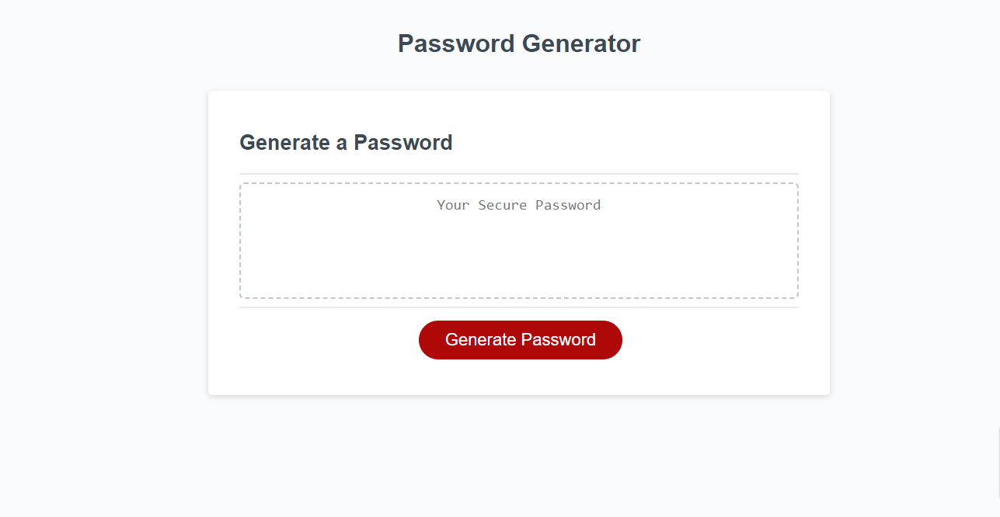

# Password Generator

## Description
Motivation
- The Random Password Generator is designed to provide users with a convenient and secure way to generate strong passwords. This tool aims to empower users to create passwords that meet specific criteria, ensuring a higher level of security for their accounts and sensitive information.

Purpose
- The purpose of this application is to streamline the process of password creation, eliminating the need for users to manually come up with complex combinations of characters. By offering a user-friendly interface and customizable criteria, the Random Password Generator makes it easy for individuals to generate strong passwords tailored to their specific needs and preferences.

Problems
- This application tackles problems such as individuals who struggle to create passwords that meet recommeded security standards, alleviating anxiety while trying to attempt such a robust strong password, and security concerns that arise from having weak passwords.

Learnings
- Developing this Random Password Generator has provided valuable insights into the importance of user-friendly interfaces, input validation, and secure password generation algorithms. This project serves as a testament to the power of technology in enhancing cybersecurity practices and promoting safe online behavior.

## Screenshot

## Links
[Live URL](https://xtianhope.github.io/password-generator/)